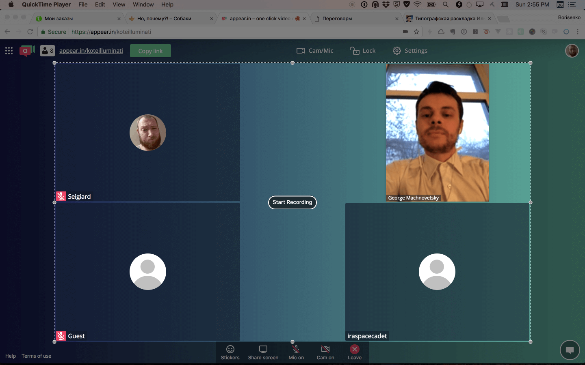

# Как записать видео

**Договоритесь, где вы будете проводить беседу**

Это может быть скайп или [переговорная котанов](http://appear.in/koteilluminati). Мы рекомендуем переговорную котанов, туда можно позвать друзей для фидбэка.

**Протестируйте, что всё в порядке**

В техническом плане не стоит быть «не в порядке». Убедитесь, что у обоих проигрывается видео и вы слышите друг друга.

**Установите программу для записи видео и звука**

**Для маков** студенты испробовали [ScreenFlow](https://www.telestream.net/screenflow/).

Скачайте, установите её и протестируйте, как она записывает. Бесплатной версии хватит на неделю учёбы.

**«Quick Time Player»** — ещё более простое решение для владельцев маков. Но используйте её без наушников, иначе запишется только ваш голос.

Запустите её, выберите «File → New Screen Recording» или нажмите «ˆ⌘N».

Нажмите красную кнопку записи в появившемся окне, выберите нужную часть экрана, нажмите кнопку записи и через пару секунд приступайте к переговорам.

После завершения переговоров, закончите запись и экспортируйте в формате 720p.

**Настройтесь на работую атмосферу**

Выкурите косячек, бахните 50 грамм коньяка, помедитируйте, перечитайте Кемпа, помолитель св. Синельникому и начинайте.

PS: Приглашайте на переговоры нас, нам интересно!